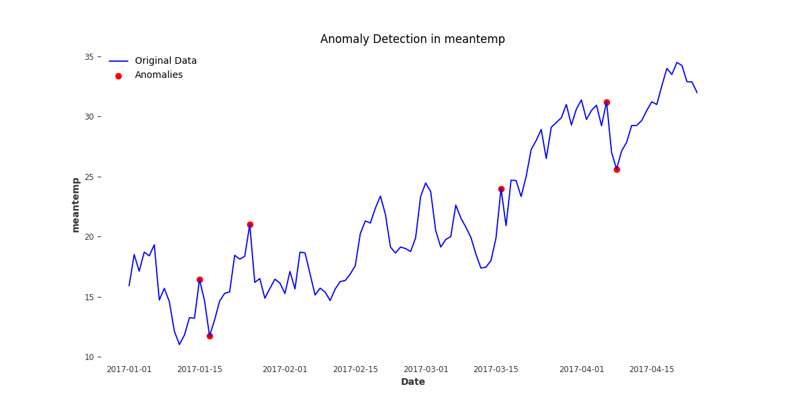
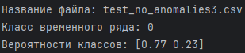
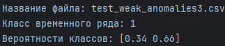
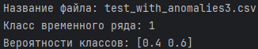

# Описание
data-set взят с сайта Kaggle, название файла time_series.

## Использование библеотек
pandas, sklearn, joblib, darts, matplotlib, numpy

## Модели
module1.py Выводит график аномалий и сохраняет в файлах(png, csv) 
module2.py Происходит обучение на модели созданной из module1.py и сгенерированных данных csv в файле create_files_CSV.py

## Запуск обученной модели
Происходит в файле using_trained_model.py

## Проверка классов
test_no_anomalies3.csv, 
test_weak_anomalies3.csv, 
test_with_anomalies3.csv

# График аномамалий

# Вывод результатов
## test_no_anomalies3.csv

## test_weak_anomalies3.csv

## test_with_anomalies3.csv
